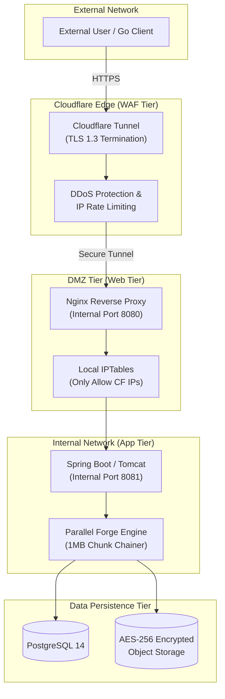
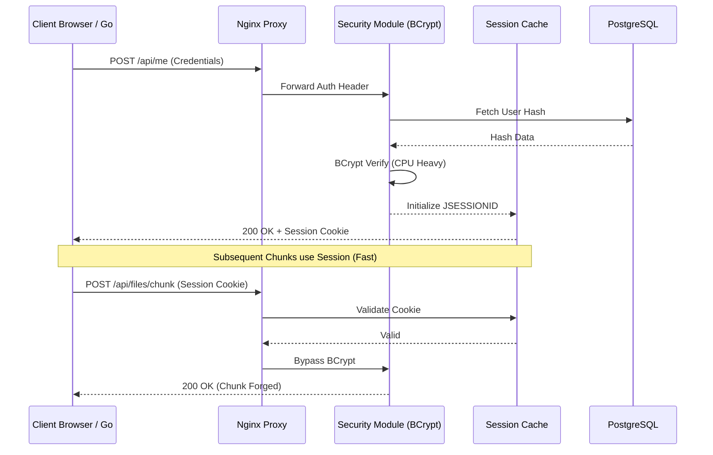
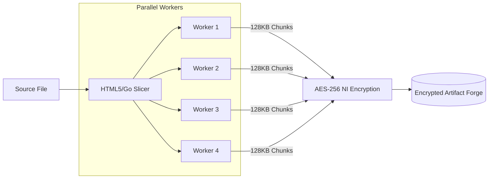

# SyncForge Infrastructure & Security Flowcharts

SyncForge utilizes a high-security, multi-layered architecture designed to mask latency and protect data integrity.

## 1. Infrastructure & Firewall Topology
This diagram illustrates the flow of data through the security tiers and firewall layers.

## 2. Authentication & Session Security Flow
SyncForge uses a hybrid BCrypt/Session model to optimize high-concurrency performance.

## 3. Parallel Data Forging Pipeline (1MB)
Visualizing the high-speed ingestion logic.

